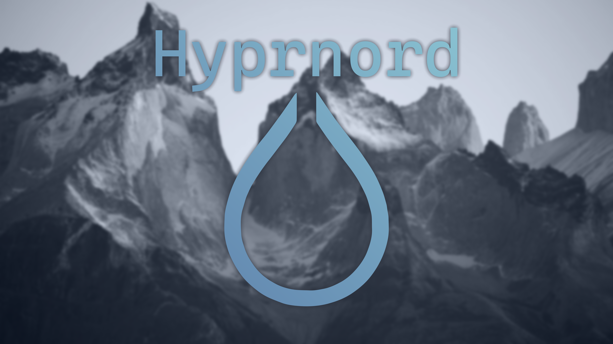

[](https://www.youtube.com/watch?v=mIKWoNQUwN4)

## [Nordic](https://www.nordtheme.com/) [Hyprland](https://hyprland.org/) Rice

## Setup

### Cloning

Simply run this:

```sh
git clone --recurse-submodules https://github.com/nnra6864/Ricerland.git ~
```

Cloning without `--recurse` will result in missing submodules such as nvim, shaders, ricer stuff etc.

### Updating

To pull all the latest changes, including submodules, run:
```sh
git pull --recurse
```

## Fonts

- [Maple Mono NF CN](https://github.com/subframe7536/maple-font)
- [Cascadia Code NF](https://github.com/microsoft/cascadia-code)
- [Hurmit NF](https://github.com/ryanoasis/nerd-fonts/releases/download/v3.4.0/Hermit.zip)

## Apps

- [Ricer](https://github.com/nnra6864/Ricer) - Rice with ease
- [Hyprmouse](https://github.com/nnra6864/Hyprmouse) - Control the mouse with your keyboard using Vim Motions `SUPER+M`
- [hyprshot](https://github.com/Gustash/Hyprshot) - Excellent screenshot utility `ALT+X` *region* `main_mod+ATL+X` *active window* `main_mod+CTRL+X` *window* `Print` *fullscreen*
- [fish](https://fishshell.com/) - Best shell

# ☦ Ι̅Ϲ̅ Χ̅Ϲ̅ ΝΙΚΑ — Ὁ Ὤν

Εἰς δόξαν τοῦ Θεοῦ<br>
*To the glory of God*

Τῇ Ὑπεραγίᾳ Θεοτόκῳ δόξα<br>
*Glory to the Most Holy Theotokos*

Δόξα τῷ Θεῷ πάντων ἕνεκεν<br>
*Glory to God for all things*

ΑΜΗΝ

☦
